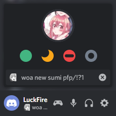

# Status Picker+
Makes Discord's status picker look spicier. Credit to [Tropical](https://github.com/Tropix126) for the original code, I made a revamped version of it off of his original creation.



# Installation
For **[Powercord](http://powercord.dev/)** or **[Vizality](https://vizality.com/)** installation, go to **Themes -> Open a CMD / Powershell / Terminal / Gitbash** in the folder, and enter the following:
```
git clone https://github.com/Discord-Theme-Addons/statuspicker-plus
```

**For [BetterDiscord](https://betterdiscord.net/):**
- [Direct Dowload](https://github.com/Discord-Theme-Addons/statuspicker-plus/releases/download/v1.0.4/StatusPickerPlus.theme.css)
- [View Source](https://raw.githack.com/Discord-Theme-Addons/statuspicker-plus/master/src/support/StatusPickerPlus.theme.css)

**For Browser / Web:**
1. Install the Stylus extension for [Chrome](https://chrome.google.com/webstore/detail/stylus/clngdbkpkpeebahjckkjfobafhncgmne) / [Firefox](https://addons.mozilla.org/en-US/firefox/addon/styl-us/) / [Opera](https://github.com/openstyles/stylus/wiki/Opera,-Outdated-Stylus).
2. After installing, head over to [this link](https://raw.githack.com/Discord-Theme-Addons/statuspicker-plus/master/src/support/StatusPickerPlus.user.css).
3. Press the "Install Style" button.
